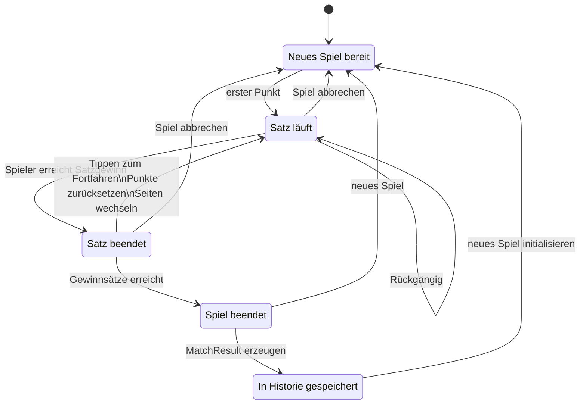

# Architektur

MatchPoint ist eine moderne Single-Page-Anwendung (SPA), die vollständig im Browser ausgeführt wird.

Die Anwendung wurde bewusst modular aufgebaut. Die Spiellogik, Benutzeroberfläche und Datenhaltung sind voneinander getrennt, sodass einzelne Bereiche unabhängig weiterentwickelt werden können.

## Architekturüberblick

```text
┌──────────────────────────────────────────────────────────────┐
│                           React UI                           │
│                                                              │
│  Components  Dialogs  Pages  Hooks                           │
└──────────────────────────────┬───────────────────────────────┘
                               │
                               ▼
┌──────────────────────────────────────────────────────────────┐
│                        Spiellogik                            │
│                                                              │
│   Punkte │ Aufschlag │ Satzgewinn │ Spielgewinn │ Historie   │
└──────────────────────────────┬───────────────────────────────┘
                               │
                               ▼
┌──────────────────────────────────────────────────────────────┐
│                      Persistenz (Dexie)                      │
│                                                              │
│     Spieler │ Einstellungen │ Spielhistorie │ Tasten         │
└──────────────────────────────┬───────────────────────────────┘
                               │
                               ▼
┌──────────────────────────────────────────────────────────────┐
│                 Browser / Progressive Web App                │
│                                                              │
│ IndexedDB │ Service Worker │ Manifest │ Installation         │
└──────────────────────────────────────────────────────────────┘
```

---

## Projektstruktur

Die wichtigsten Verzeichnisse sind:

```text
src/
├── components/     Wiederverwendbare React-Komponenten
├── dialogs/        Dialoge und Overlays
├── hooks/          Custom Hooks und Anwendungslogik
├── logic/          Spiellogik
├── storage/        IndexedDB (Dexie)
├── types/          Gemeinsame TypeScript-Typen
├── i18n/           Übersetzungen
└── assets/         Grafiken und Logos
```

---

## Benutzeroberfläche

Die Benutzeroberfläche basiert vollständig auf React.

Die einzelnen Komponenten sind möglichst klein gehalten und übernehmen jeweils genau eine Aufgabe.

Beispiele:

- Anzeige des Spielstands
- Einstellungsdialog
- Spielhistorie
- Profilauswahl

Die eigentliche Spiellogik befindet sich bewusst nicht in den Komponenten.

---

## Spiellogik

Die Regeln des Tischtennissports sind vollständig von der Benutzeroberfläche getrennt.

Dazu gehören unter anderem:

- Punkte zählen
- Aufschlagwechsel
- Satzgewinn
- Spielgewinn
- Seitenwechsel

Dadurch kann die Spiellogik unabhängig getestet und erweitert werden.

---

## State Management

Der aktuelle Spielzustand wird innerhalb eines zentralen React Hooks verwaltet.

Dieser enthält unter anderem:

- aktuellen Punktestand
- Satzstand
- Aufschlag
- Spieler
- Einstellungen
- laufendes Spiel

Die React-Komponenten stellen den Zustand lediglich dar und lösen Benutzeraktionen aus.

---

## Persistenz

MatchPoint verwendet **Dexie.js** als komfortable Abstraktion für IndexedDB.

Gespeichert werden unter anderem:

- Spielerprofile
- Einstellungen
- Tastenbelegungen
- abgeschlossene Spiele

Alle Daten verbleiben ausschließlich auf dem lokalen Gerät.

---

## Progressive Web App

Die Anwendung kann als Progressive Web App installiert werden.

Zum PWA-Konzept gehören:

- Service Worker
- Web App Manifest
- Offline-Unterstützung
- automatische Updates
- Homescreen-Installation

Dadurch verhält sich MatchPoint nahezu wie eine native Anwendung.

---

## Internationalisierung

Für die Mehrsprachigkeit kommt **react-i18next** zum Einsatz.

Alle Texte befinden sich zentral in Sprachdateien und können unabhängig vom Quellcode gepflegt werden.

Aktuell werden unterstützt:

- Deutsch
- Englisch

Weitere Sprachen können jederzeit ergänzt werden.

---

## Eingabegeräte

Neben der Touch-Bedienung unterstützt MatchPoint externe Eingabegeräte.

Dabei verarbeitet die Anwendung ausschließlich Standard-Tastaturevents.

Dadurch können unterschiedliche Geräte verwendet werden, beispielsweise:

- USB-Tastaturen
- Bluetooth-Tastaturen
- HID-Remotes
- Presenter
- programmierbare Keypads

Die Zuordnung der Tasten erfolgt innerhalb der Anwendung und wird lokal gespeichert.

---

## Designprinzipien

Die Architektur von MatchPoint folgt einigen grundlegenden Prinzipien:

- **Offline First** – alle Kernfunktionen funktionieren ohne Internetverbindung.
- **Local First** – sämtliche Daten verbleiben auf dem Gerät.
- **Open Source** – der Quellcode ist öffentlich einsehbar und kann erweitert werden.
- **Modularität** – Komponenten und Logik sind klar voneinander getrennt.
- **Type Safety** – TypeScript sorgt für eine möglichst hohe Typsicherheit.

## Spielablauf


