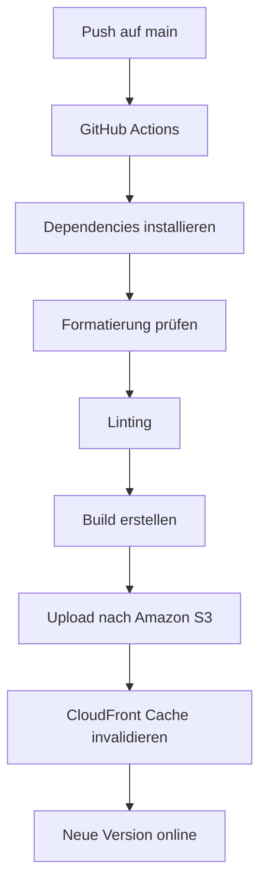

# Deployment

MatchPoint wird automatisch über GitHub Actions gebaut und veröffentlicht.

Die Anwendung selbst wird nach **Amazon S3** deployed und über **Amazon CloudFront** ausgeliefert. Die Projektdokumentation wird separat über **GitHub Pages** veröffentlicht.

---

## Überblick



---

## App-Deployment

Das App-Deployment wird über den Workflow in `.github/workflows/deploy-app.yml` ausgeführt.

Der Workflow läuft bei Änderungen an der Anwendung, zum Beispiel:

- `src/**`
- `public/**`
- `assets/**`
- `scripts/**`
- `package.json`
- `vite.config.ts`
- `tsconfig*.json`
- `.github/workflows/deploy-app.yml`

Änderungen an der Dokumentation unter `docs/**` lösen kein App-Deployment aus.

---

## Ablauf

Bei jedem relevanten Push auf `main` werden folgende Schritte ausgeführt:

1. Repository auschecken
2. Node.js einrichten
3. Abhängigkeiten installieren
4. Formatierung prüfen
5. ESLint ausführen
6. Produktions-Build erstellen
7. Build nach Amazon S3 synchronisieren
8. CloudFront Cache invalidieren

---

## Build

Der Produktions-Build wird mit folgendem Befehl erstellt:

```bash
npm run build
```

Dabei werden automatisch auch die PWA-Icons generiert, da `npm run icons` über das `prebuild`-Script ausgeführt wird.

Das Ergebnis liegt anschließend im Ordner:

```text
dist/
```

---

## Version und Build-Informationen

Während des Builds werden Versionsinformationen als Vite-Environment-Variablen gesetzt:

```yaml
VITE_APP_VERSION: ${{ github.ref_name }}
VITE_COMMIT_SHA: ${{ github.sha }}
```

Diese Informationen werden in der Anwendung im Einstellungsdialog angezeigt.

Beispiele:

```text
Version: main
Build: a1b2c3d
```

oder bei einem Release:

```text
Version: v0.1.0
Build: a1b2c3d
```

---

## Amazon S3

Der fertige Build wird mit der AWS CLI in den S3-Bucket synchronisiert:

```bash
aws s3 sync dist/ s3://<bucket-name> --delete
```

Die Option `--delete` sorgt dafür, dass Dateien im Bucket entfernt werden, die im aktuellen Build nicht mehr existieren.

---

## Amazon CloudFront

Nach dem Upload wird der CloudFront-Cache invalidiert:

```bash
aws cloudfront create-invalidation \
  --distribution-id <distribution-id> \
  --paths "/*"
```

Dadurch wird sichergestellt, dass Nutzer nach einem Deployment zeitnah die neue Version erhalten.

---

## GitHub Secrets

Für das Deployment werden folgende GitHub Secrets benötigt:

| Secret | Beschreibung |
|---|---|
| `AWS_DEPLOY_ROLE_ARN` | ARN der IAM-Rolle für GitHub Actions |
| `AWS_S3_BUCKET` | Name des S3-Buckets |
| `AWS_CLOUDFRONT_DISTRIBUTION_ID` | ID der CloudFront Distribution |

---

## AWS-Berechtigungen

Die GitHub-Actions-Rolle benötigt Berechtigungen für:

- S3 Bucket auflisten
- Dateien in S3 hochladen
- Dateien aus S3 löschen
- CloudFront Invalidations erstellen

Beispielhafte Berechtigungen:

```json
{
  "Version": "2012-10-17",
  "Statement": [
    {
      "Effect": "Allow",
      "Action": ["s3:ListBucket"],
      "Resource": "arn:aws:s3:::<bucket-name>"
    },
    {
      "Effect": "Allow",
      "Action": ["s3:PutObject", "s3:DeleteObject"],
      "Resource": "arn:aws:s3:::<bucket-name>/*"
    },
    {
      "Effect": "Allow",
      "Action": "cloudfront:CreateInvalidation",
      "Resource": "arn:aws:cloudfront::<account-id>:distribution/<distribution-id>"
    }
  ]
}
```

---

## OIDC mit GitHub Actions

Das Deployment verwendet OpenID Connect (OIDC), damit keine langfristigen AWS-Zugangsdaten in GitHub gespeichert werden müssen.

Die Trust Policy der IAM-Rolle erlaubt GitHub Actions, die Rolle für das Repository anzunehmen.

Dabei muss berücksichtigt werden, ob der Workflow für Branches, Tags oder beides laufen soll.

Beispiel:

```json
{
  "Effect": "Allow",
  "Principal": {
    "Federated": "arn:aws:iam::<account-id>:oidc-provider/token.actions.githubusercontent.com"
  },
  "Action": "sts:AssumeRoleWithWebIdentity",
  "Condition": {
    "StringEquals": {
      "token.actions.githubusercontent.com:aud": "sts.amazonaws.com"
    },
    "StringLike": {
      "token.actions.githubusercontent.com:sub": [
        "repo:<owner>/<repo>:ref:refs/heads/main",
        "repo:<owner>/<repo>:ref:refs/tags/v*"
      ]
    }
  }
}
```

---

## Dokumentations-Deployment

Die Dokumentation wird mit VitePress gebaut und über GitHub Pages veröffentlicht.

Der zugehörige Workflow läuft nur bei Änderungen im Ordner:

```text
docs/**
```

oder bei Änderungen am Pages-Workflow.

Der Build erfolgt mit:

```bash
npm run docs:build
```

Das Ergebnis liegt unter:

```text
docs/.vitepress/dist
```

---

## Releases

Für Releases werden Git-Tags verwendet.

```bash
git tag -a v0.1.0 -m "Release v0.1.0"
git push origin v0.1.0
```

Bei einem Tag-Release kann zusätzlich ein GitHub Release mit einem ZIP-Artefakt des Builds erstellt werden.

---

## Deployment lokal prüfen

Vor einem Push sollte lokal geprüft werden:

```bash
npm run format:check
npm run lint
npm run build
npm run docs:build
```

Erst wenn alle Befehle erfolgreich durchlaufen, sollte der Stand veröffentlicht werden.